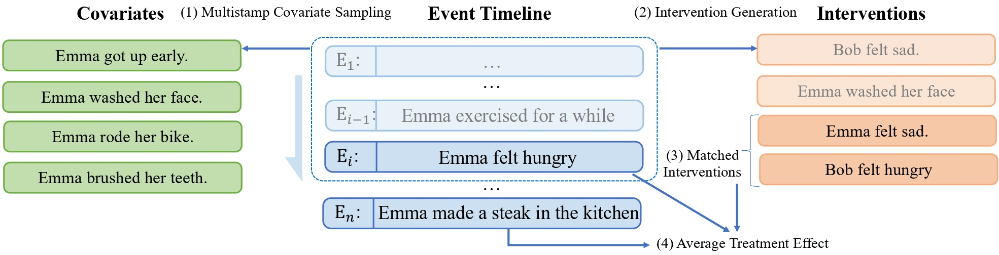

# COLA: Contextualized Commonsense Causal Reasoning from the Causal Inference Perspective

This repository is the official implementation of 
[COLA: Contextualized Commonsense Causal Reasoning from the Causal Inference Perspective](https://arxiv.org/abs/2305.05191). 

The paper is accepted to the main conference of ACL 2023.

<div align="center">
    
    <span>An Overview of Our Method</span>
</div>


## Requirements
Python version is 3.8.5

requirements:
```setup
allennlp_models==2.10.1
datasets==2.6.1
evaluate==0.3.0
matplotlib==3.6.1
numpy==1.23.4
pandas==1.5.0
pathos==0.2.9
statsmodels==0.13.2
torch==1.10.2
tqdm==4.64.1
transformers==4.20.0
ujson==5.5.0
```
You can install all requirements with the command
```
pip install -r requirements.txt
```

## Datasets
### Data for Temporal Predictor
We extract a large dataset containing 800K pairs of events and their temporal order from RocStories.
You can download it here [download](https://hkustconnect-my.sharepoint.com/:f:/g/personal/zwanggy_connect_ust_hk/El2TUD1xc_5NtMIYas5RBLoBrC6dyFhBjIrl2xyHZzfpHg?e=MEV5hM)
All licenses are subject to RocStories' original release.

### Choice of Plausible Event in Sequence (COPES)
The contextualized commonsense causal reasoing dataset COPES is in the dir ```./COPES_data```. 

## Run COLA Framework
Our COLA Framework owns a few steps to conduct inference.

### Step1: Fine-tune a Temporal Predictor with incidental supervision signals
First, you need to fine-tune a temporal predictor, which learns temporal relations.
The code for this part is in ```mlm.py``` and ```mlm_util.py```.

We provide an example command in the script ```run_script/finetune_mlm.sh```. It fine-tunes
bert-base-uncased, you can change it to other models.

### Step2: Sample Covariates
Second, you need to sample covariates for each event. 
Run the script ```run_script/sample_covariates.sh```.

After getting the covariates, you need to do ```Multistamp Covariate Sampling```, which
tasks the union of covariates sampled at multiple timestamps.
Run the example command 
```mix covariates
python mix_covariate.py --input_path YOUR_COVARIATES --output_path YOUR_OUTPUT_PATH --copes_path ./COPES_data/COPES.json
```

### Step3: Sample Interventions
To generate interventions of events, you first need to run SRL tool 
to extract verbs and two arguments ```ARG0``` and ```ARG1```:
```
python SRL_parsing.py --data_path ./COPES_data/COPES.json \
--model_path structured-prediction-srl-bert --batch_size 512 \
--output_dir YOUR_OUTPUT_DIR
```

### Step4: Temporal Relation Reasoning
After generating covariates and interventions, you can predict the temporal relations 
between covariates, interventions and RocStories events.

For temporal relations in covariate balancing (between covariates and interventions/original causes),
run ```run_script/get_cov-inter.sh```.

For average treatment effect (between interventions/original causes and caused events), 
run ```run_script/get_inter-outcome.sh```.


### Conduct Inference
Finally, you can conduct causal inference based on temporal relations: run
```run_script/evaluate.sh```.

## Pre-Computed Results
Some operations are computationally heavy (e.g., using GPT-J-6b), 
you can download our pre-computed results here 
[download](https://hkustconnect-my.sharepoint.com/:f:/g/personal/zwanggy_connect_ust_hk/EiIqMwyEtHtNsLDDkh9MgSsBdDwTKY1g9E0VuHldaj7DGA?e=8aZ1Ym)
Temporal relations are predicted by fine-tuned bert-base-uncased.

## Contributing
If you find any typo or bug, please open an issue.
This repo is maintained by [Zhaowei Wang](https://zhaowei-wang-nlp.github.io/)